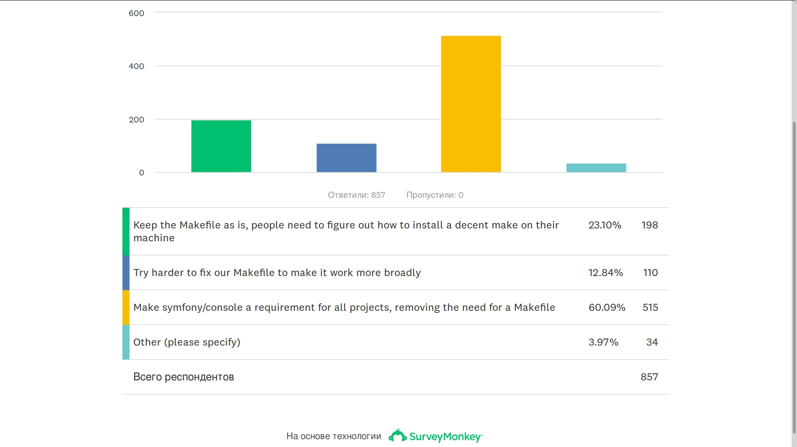
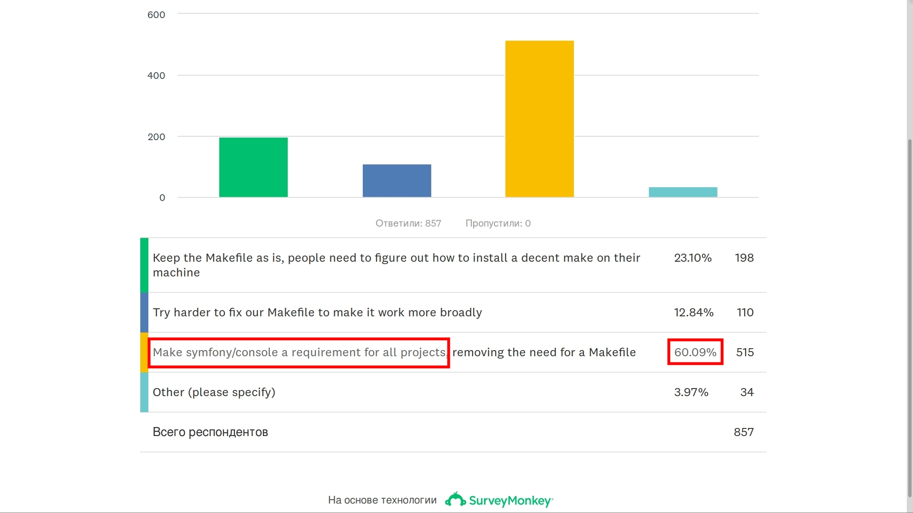
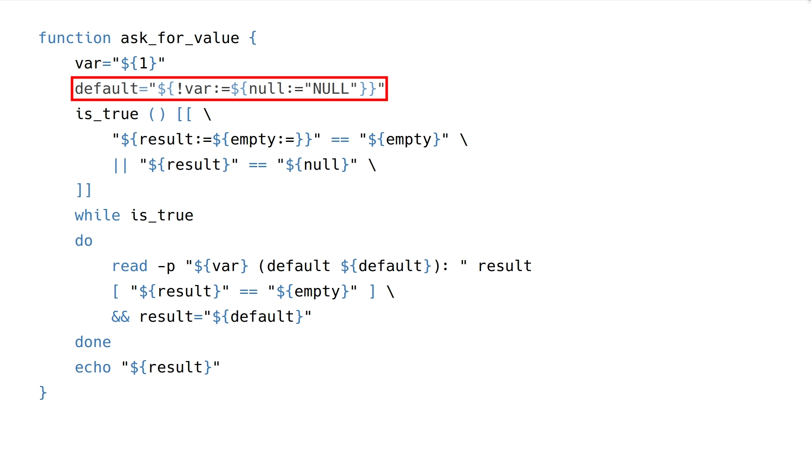
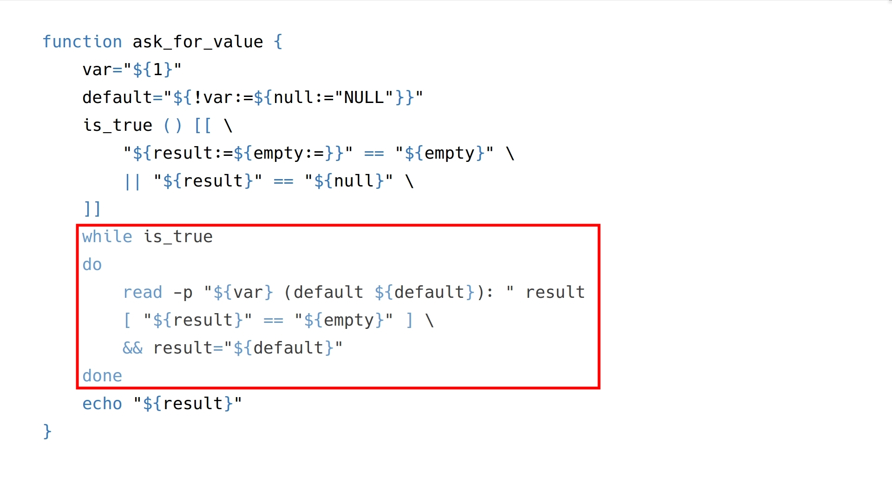
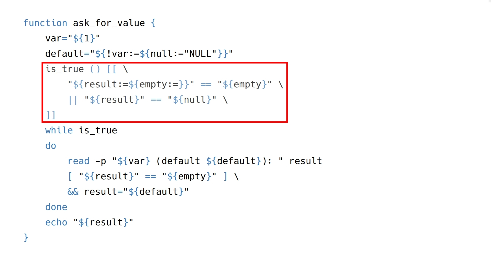
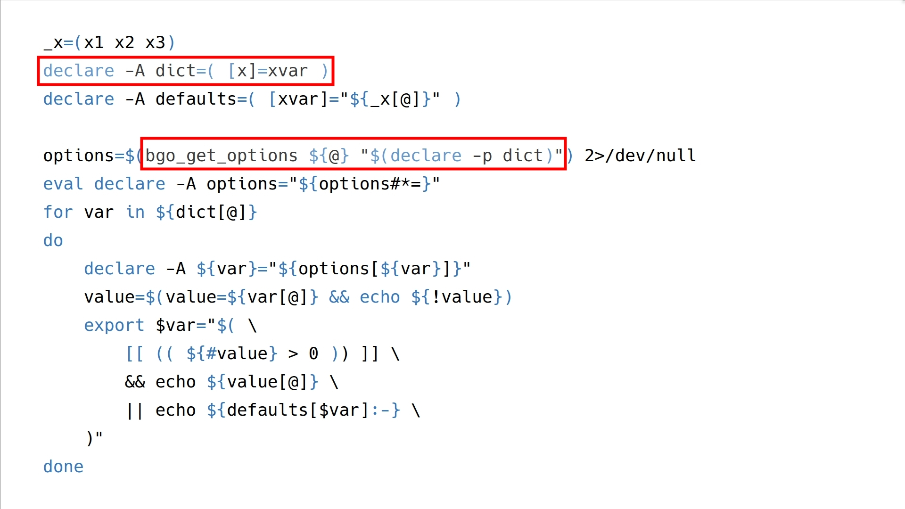
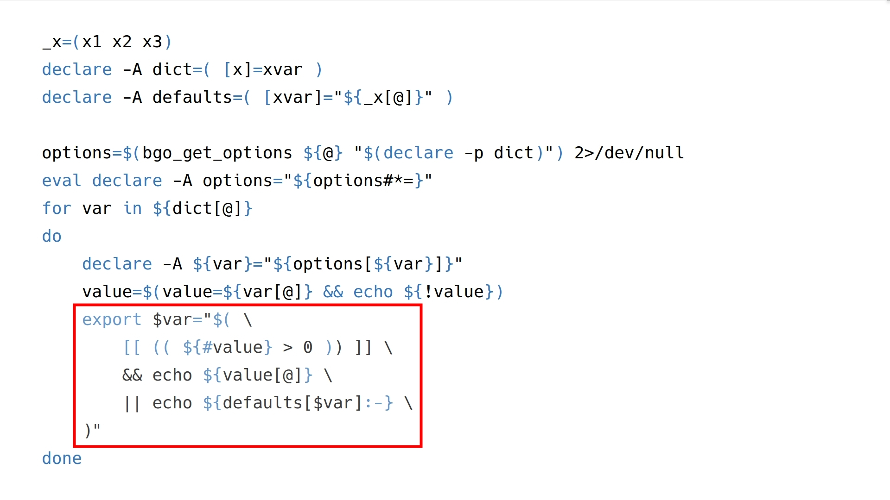

---

layout: yandex2

style: |
    /* собственные стили можно писать здесь!! */
    .pre-small pre code { font-size: 24px!important; line-height: 48px!important; }
    .pre-big pre code { font-size: 54px !important; line-height: 108px !important; } #  9 lines x 52 symbols
    .big-list { font-size: 80px!important; line-height: 160px!important; }
    .images-w { background-color: #fff !important; }
    .slide-red { border-left: 9px solid #f00 !important; }
    figure.short { width: 480px !important; }
    .text-center { text-align: center !important; }
    img.center { margin: auto !important; }

---

# {:.logo}

## {{ site.presentation.title }}
{:.title}

### {{ site.presentation.service }}

<div class="authors">

<p>{{ site.author.name }}, {{ site.author.position }}</p>

</div>

## Цели

**Автоматизация рутинных задач разработчика**

**Минимизация времени разворачивания проекта**

## Неприятности

**По умолчанию молчим**{:.slide-red.next}

**Заставляем пользователя менять текущую директорию**{:.slide-red.next}

## Грехи

**Сложная инструкция**{:.slide-red.next}

**Неявные зависимости**{:.slide-red.next}

**Гонка за новинками**{:.slide-red.next}

**Пренебрежение другими платформами**{:.slide-red.next}

**Пренебрежение стратегией версирования**{:.slide-red.next}

**Успокоиться после первого релиза**{:.slide-red.next}

## Опасности и различия

**Окружение**{:.slide-red.next}

**Ресурсы**{:.slide-red.next}

## Задачи
{:.section}

## Задачи

**Минимальное использование сторонних зависимостей**

- {:.next}подготовка переменных окружения и реквизитов доступа
- {:.next}установка инструментов сборки и тестирования
- {:.next}запуск виртуальных машин и контейнеров
- {:.next}выкладка локально и удалённо

## Задачи: основа

- {:.next}интерактивный режим
- {:.next}операции со строками и массивами
- {:.next}группировка операций
- {:.next}операции с файлами
- {:.next}логирование
- {:.next}не допускать гонки состояний

## Варианты
{:.images.three}

{:.images-w.next.center}

{:.images-w.next.center}

{:.images-w.next.center}

## Варианты
{:.images.three.text-center}

{:.images-w.center}
*composer*

{:.images-w.center}
*symfony console*

{:.images-w.center}
*bash*

## Composer

**Сборка php приложения**

## Composer - сборка php приложения

**Управление зависимостями**

**Сборка проекта**

## Symfony console

**Инструмент общего назначения для symfony приложений**

## Symfony console и symfony flex

Фабьен Потенсьер:

```
The #Symfony 4 Makefile (from Flex) does not work well on some systems.
We need to find solution.
But which one?
```

## Сборка symfony 4
{:.fullscreen}



## Сборка symfony 4 и symfony console
{:.fullscreen}



## Symfony console есть готовое

- приложение из одной команды
- обработка входных параметров
- набор готовых вспомогательных функций
- группировка команд
- контроль за гонкой состояний
- логирование

## Bash

**Инструмент общего назначения**

## Bash
{:.fullscreen}


<figure markdown="1">
Bash
</figure>{:.short}

## Bash: минусы

**Нет модульных тестов**{:.slide-red.next}

**Глобальный контекст если не подпроцесс**{:.slide-red.next}

## Bash: плюсы

**Доступен из коробки**

**Лаконичный синтаксис**

**Большой набор побочных эффектов :)**

## Bash: требования  к коду

**Процедурность**

**Читаемость**

**Должен существовать один - и, желательно, только один - очевидный способ сделать это (PEP 20)**

## Bash
{:.fullscreen}


<figure markdown="1">
Когда следуешь CS
</figure>

## Bash: процедурность

- использование группировки команд
- использование выражений

## Bash: процедурность
{:.fullscreen.pre-big}
```bash
(( cmd1 >  cmd2 )) # арифметические выражения
[[ cmd1 || cmd2 ]] # логические выражения
   cmd1 ;  cmd2    # последовательно
   cmd1 && cmd2    # с проверкой "если"
   cmd1 || cmd2    # с проверкой "иначе"
{  cmd1 ;  cmd2; } # с группировкой вывода
(  cmd1 ;  cmd2  ) # + изоляция переменных
$( cmd1 ;  cmd2  ) # + inline                   
```

## Bash: группировка вывода операций
простая группировка

```bash
{ echo 1; echo 2; } | tac              # 2 1
```

группировка с изоляцией

```bash
x=1; ( x=2; echo "${x}" ); echo "${x}" # 2 1
```

## Bash: процедурность и PEP 20
{:.section}

## Bash: процедурность и PEP 20
{:.fullscreen.pre-big}
```bash
         cmd10 () ( cmd2  ) # основной способ
         cmd11 () { cmd2; }
function cmd12    { cmd2; }
function cmd13 () { cmd2; }
function cmd14 () ( cmd2  )
```

## Bash: читаемость
{:.section}

## Bash: нечитаемость
{:.fullscreen.pre-big}
```bash
# как можно это улучшить?


stat --printf="%s" "${file}" 2>>/dev/null 1>&2 \
&& echo "file found" \
|| echo "file not found"
```

## Bash: читаемость
{:.fullscreen.pre-big}
```bash
# 1. обернуть в функцию
filecheck () (
  local file="${1}"
  stat --printf="%s" "${file}" 2>>/dev/null 1>&2
)
filecheck ${file} \
&& echo "file found" \
|| echo "file not found"
```

## Bash: читаемость 2
{:.fullscreen.pre-big}
```bash
# 2. вынести работу с потоками
filecheck () (
  local file="${1}"
  stat --printf="%s" "${file}"
) 2>>/dev/null 1>&2
filecheck ${file} \
&& echo "file found" \
|| echo "file not found"
```

## Bash: задачи

**Подготовка переменных окружения и реквизитов доступа**

**Установка инструментов сборки и тестирования**

**Запуск виртуальных машин и контейнеров**{:.slide-red}

**Выкладка локально и удалённо**{:.slide-red}

### красным выделено то, что лучше поручить специализированным утилитам

## Bash: подготовка переменных окружения

1. интерактив
1. значение по умолчанию
1. файл
1. окружение или опция запуска

## Bash: подготовка переменных окружения, пример
{:.fullscreen.pre-big}
```bash
$ cat .env
VAR=${VAR:-"file"}
$ cat cmd.sh

[ -f .env ] && source .env

echo ${VAR:-"code"}
```

## Bash: подготовка переменных окружения, пример
{:.fullscreen.pre-big}
```bash
# 1. файл .env не найден
./run.sh                 # code
# 2. файл .env найден
./run.sh                 # file
# 3. используем переменную окружения
VAR=input ./run.sh       # input
```

## Bash: а где интерактив?
{:.blockquote}

## Bash: а где интерактив? функция
{:.fullscreen}
```bash
function ask_for_value {
    var="${1}"
    default="${!var:=${null:="NULL"}}"
    is_true () [[ \
        "${result:-${empty:=}}" == "${empty}" \
        || "${result}" == "${null}" \
    ]]
    while is_true
    do
        read -p "${var} (default ${default}): " result
        [ "${result}" == "${empty}" ] \
        && result="${default}"
    done
    echo "${result}"
}
```

## Bash: а где интерактив? функция, важно
{:.fullscreen}



## Bash: а где интерактив? функция, важно
{:.fullscreen}



## Bash: а где интерактив? функция, важно
{:.fullscreen}



## Bash: а где интерактив? использование
{:.fullscreen.pre-big}
```bash

for var in username password
do
    echo "${var}"="$(ask_for_value "${var}")"
done
```

## Bash: а где интерактив? использование 2
{:.fullscreen.pre-big}
```bash
vars="username password" # vars=( username password )
for var in ${vars[@]}
do
    echo "${var}"="$(ask_for_value "${var}")"
done
```

## Bash: операции со строками и массивами
{:.blockquote}

## Bash: операции со строками 1
{:.fullscreen.pre-big}
```bash
x="wHO aM I"
y="who "
${x,,}                                      # who am i
${x^^}                                      # WHO AM I
${y^}                                       # Who
$(x=${x,,} && echo ${x^})                   # Who am i
${y:1:-1}                                   # ho
${#y}                                       # 4
$(x=${x:${#y}:2} && x=${x,,} && echo ${x^}) # Am
```

## Bash: операции со строками 2
{:.fullscreen.pre-big}
```bash
string="foobarbaz"
prefix="foo"
suffix="baz"
${string#$prefix}                           # barbaz
${string%$suffix}                           # foobar
$(t=${string%$suffix} && echo ${t#$prefix}) # bar
```

## Bash: операции со строками 3
{:.fullscreen.pre-big}
```bash
x="baz quuuux"
z="quuuux"
y=z
${x:0:(( \
    ${#x} - $( \
        t=${!y} && echo ${#t} \
    ) - 1 \
))}                               # baz
```

## Bash: trim
{:.fullscreen}
```bash
function trim {
    local char=$( \
        [ ! -z "${2}" ] \
        || echo "[:space:]" \
        && echo "${2}" \
    )
    [[ "$1" =~ ^["$char"]*(.*[^"$char"])["$char"]*$ ]] \
    || echo ${1} \
    && printf "%s" "${BASH_REMATCH[1]}"
}
echo $(trim "--test--test-test-" "-") # test--test-test
```

## Bash: операции с массивами

1. инициализация и итерирование
1. произвольный доступ
1. массив как параметр функции
1. переменная переменной
1. массив как результат функции

## Bash: инициализация массивов и итерирование
```bash
               " username     password " # нельзя обращаться по индексу
               ( username     password ) # доступны в порядке объявления
declare -a ( [2]=password [0]=username ) # сортируются
declare -A ( [p]=password [u]=username ) # нельзя передавать в функцию
```

## Bash: массив как параметр
{:.section}

## Bash: массив как параметр вопрос
{:.fullscreen.pre-big}
```bash
vars=(2 3)
echo_vars () (
    echo ${1}
    echo ${2}
    echo ${3}
)
echo_vars 1  ${vars[@]}  4 # ?
echo_vars 1 "${vars[@]}" 4 # ?
```

## Bash: массив как параметр ответ
{:.fullscreen.pre-big}
```bash
vars=(2 3)
echo_vars () (
    echo ${1}
    echo ${2}
    echo ${3}
)
echo_vars 1  ${vars[@]}  4 # 1 2 3
echo_vars 1 "${vars[@]}" 4 # 1 2 3
```

## Bash: переменная переменных
{:.fullscreen.pre-big}
```bash
vars=(2 3)
echo_vars () (
    echo ${1}
    echo $(_vars=${2}[@] && echo "${!_vars}")
    echo ${3}
)
echo_vars 1 vars 4 # 1 2 3 4
```

## Bash: массив как результат функции

**Используйте ассоциативные массивы**

**Используйте bash_get_options hanovruslan@github**

```bash
declare -A vars=( [p]=password [u]=username )
declare -p vars
```

## Применение

**Разбирать опции запуска скрипта**

## Применение - разбирать опции запуска скрипта
{:.fullscreen.pre-big}
```bash
$ script.sh -x 1 -x 10 -b xyz
```

## Bash: bash_get_options 0
{:.fullscreen}
```bash
_x=(x1 x2 x3)
declare -A dict=( [x]=xvar )
declare -A defaults=( [xvar]="${_x[@]}" )

options=$(bgo_get_options ${@} "$(declare -p dict)") 2>/dev/null
eval declare -A options="${options#*=}"
for var in ${dict[@]}
do
    declare -A ${var}="${options[${var}]}"
    value=$(value=${var[@]} && echo ${!value})
    export $var="$( \
        [[ (( ${#value} > 0 )) ]] \
        && echo ${value[@]} \
        || echo ${defaults[$var]:-} \
    )"
done
```

## Bash: bash_get_options 1
{:.fullscreen}



## Bash: bash_get_options 2
{:.fullscreen}



## bgo_get_options

## bgo_get_options
{:.fullscreen.pre-small}
```bash
    local dict=${@: -1};
    local result;
    local sep_val=":"
    local sep_case='|'
    local opt_pat;
    local opt_case=();
    local reg=();
    local cnt;
    declare -A cnt=()
    declare -A result=()
    eval "declare -A dict="${dict#*=}
    for key in ${!dict[@]}
    do
        opt_pat=${opt_pat}${key}${sep_val}
        opt_case+=(${key})
    done
    opt_case=$(printf "${sep_case}%s" "${opt_case[@]}")
    opt_case='@('${opt_case:${#sep_case}}')'
    # `shopt -s extglob` enable var substitution in the case "${opt_case})"
    shopt -q extglob; extglob_set=$?
    ((extglob_set)) && shopt -s extglob
```

## bgo_get_options

**Это только инициализация ...**{:.slide-red}

## Если вы дошли до этого, пора завязывать с Bash :)
{:.blockquote}

## Bash: операции с файлами
{:.section}

## Bash: операции с файлами
создать, удалить, наполнить, подключить

```bash
mkdir -p $(basename "${to}")
rmdir -p $(basename "${to}")
# только export и без каких-либо массивов
envsubst < "${from}" > "${to}"
# только debian
$(dirname $(readlink -f ${BASH_SOURCE[0]}))
```

## Bash: операции с файлами проверить на существование
{:.fullscreen.pre-big}
```bash
filecheck () (
    local file="${1}"
    stat --printf="%s" "${file}"
) 2>>/dev/null 1>&2
filecheck_flag () (
    filecheck ${1} && echo "1" || echo ""
)
filecheck_flag "${file_found}"     # 1
filecheck_flag "${file_not_found}" # "" - пустая строка
```

## Bash: не допускать гонки состояний

**использовать файл с $PID процесса**

## Bash: не допускать гонки состояний
{:.fullscreen.pre-big}
```bash
start_process_name () (
    exec -a "process-name" bash ./script.sh &
    echo ${!} > ./process-name.pid
) 1>>./start-process-name.log} 2>&1
[[ -f ${pid:="process-name.pid"} ]] \
&& [[ -e /proc/$(cat ${pid}) ]] \
&& echo "process-name is already started" >&2 \
|| start_process_name
```

## Bash: логирование

- перенаправлять ввод и вывод
- использовать переменные по правилу envsubst
- сделать отдельную утилиту для работы со словарём сообщений

## Заключение: правила автоматизатора

**Знать возможности используемого инструмента со всеми его плюсами и минусами**

**Найти эффективные стыки инструментов исходя из первого пункта**

## Вопросы?
{:.contacts}



<figure markdown="1">

### {{ site.author.name }}


{{ site.author.position }}


</figure>





<figure markdown="1">

### {{ site.author2.name }}


{{ site.author2.position }}


</figure>



<!-- разделитель контактов -->
-------

<!-- left -->
- {:.github}hanovruslan
- {:.telegram}hanovruslan


<!-- right -->
- {:.mail}hanov.ruslan@gmail.com
- {:.twitter}@hanovruslan
- {:.facebook}hanov.ruslan
